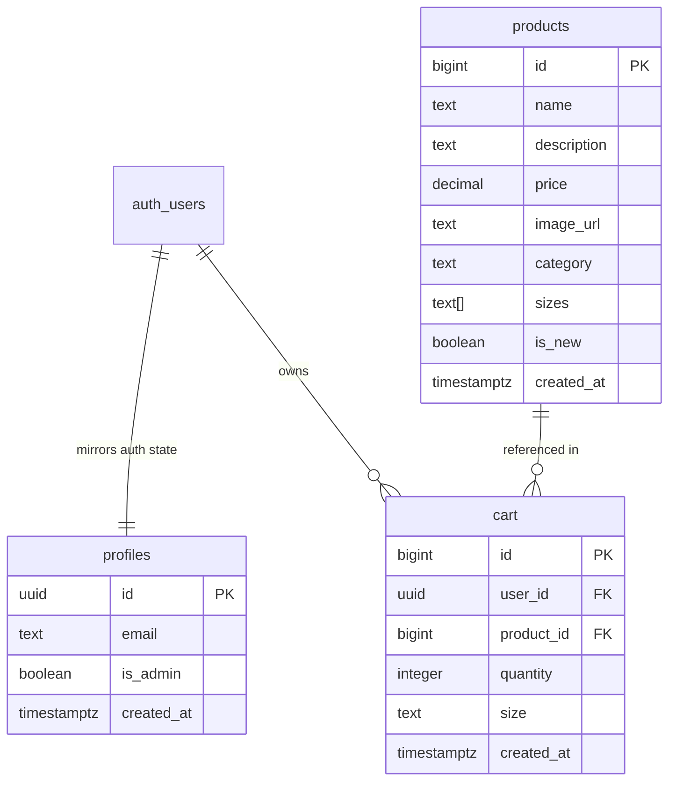

# 🌌 VELORA — Premium Minimalist Lifestyle E-commerce

Velora is a sophisticated, high-performance digital lifestyle storefront designed for modern apparel curation. Developed using **React 19 (Vite)**, **Tailwind CSS v4**, and **Supabase (PostgreSQL)**, it bridges fluid micro-interactions with robust backend synchronization, offering an ultra-premium, lag-free user experience.

---

## 🎨 Premium Design System & Aesthetics
Velora is engineered with a strict minimalist aesthetic focusing on visual clarity, premium typography, and fluid kinetic movement:
*   **Bento Grid Architecture**: A modular, content-first bento layout on the landing page, showcasing lookbook elements alongside real-time catalog selections.
*   **Tactile Animations**: Powered by **Framer Motion v12** to deliver micro-animations (e.g., expanding search inputs, springy add-to-bag triggers, and smooth layout accordion transitions).
*   **Glassmorphic Overlays**: High-end blur treatments (`backdrop-blur-xl`) applied to headers, overlays, and drawer states for ambient visual depth.
*   **Fluid Responsive Layout**: Perfectly tailored using custom container queries and flexible grid layouts to ensure a state-of-the-art presentation on desktop, tablet, and mobile displays.

---

## 🚀 Key Feature Set

### 🛡️ Role-Based Admin Panel (`/admin`)
A secure, real-time control room for administrators to monitor user engagement and store performance:
*   **Admin Route Guard**: Automatically queries profiles in the Supabase PostgreSQL database to grant/restrict access based on the custom `is_admin` security flag.
*   **Live Dashboard Analytics**: Multi-card dashboard presenting live statistics calculated on-the-fly:
    *   **Total Registered Users** (Syncing from custom profile tables).
    *   **Active Shopping Bags** (Unique users who currently have items in their cart).
    *   **Total Items** (Combined quantity count of all active bags).
    *   **Total Projected Gross Value** (Sum total value of all items currently staged in carts).
*   **Collapsible Detailed Accordions**: Admin-only inspectable customer cards showing user details, date joined, custom avatar gradients, and complete shopping bag tables (complete with product image thumbnails, chosen sizes, and line-item subtotals).
*   **On-Demand Cache Purge**: Immediate visual refresh through live database synchronizations.

### 🔍 Real-Time Debounced Search Dropdown
An instant, modern search mechanism embedded directly into the global navbar:
*   **Micro-Interaction Input**: Custom-coded search toggle with a smooth horizontal layout stretch.
*   **Database Search with Debounce**: Implements a `300ms` debounce timer that prevents search query hammering and issues remote queries to Supabase using standard SQL pattern matching (`ilike`) on the `products` table, limited to the top 5 relevant items.
*   **Pop-Over Preview Cards**: Instant rendering of item images, categories, titles, and exact pricing with clean redirect callbacks that clear the search state immediately upon product selection.

### 🎒 Dynamic Synced Cart Drawer (`CartSlider`)
A lightweight, Radix-UI-powered side-drawer that manages product items:
*   **Relational Database Syncing**: Uses a centralized React Context state (`CartContext`) that automatically coordinates local updates to the Supabase database. Cart entries survive cross-session logout/logins.
*   **Strict Selection Guard**: Features an intelligent UX validation system preventing errors. Adding a item to the shopping bag requires explicit size selection. Attempting to add an item without a size fires a custom, bottom-center non-obtrusive toast notification warning.
*   **Live Math Processing**: Updates totals, counts, subtotal badges, and pricing instantly upon increment, decrement, or deletion triggers.

---

## 🛠️ Technical Stack & Infrastructure

| Category | Technology / Library | Purpose & Implementation |
| :--- | :--- | :--- |
| **Core Framework** | React 19 (Vite) | Next-gen virtual DOM engine utilizing strict ES Modules and Vite Fast Refresh. |
| **Styling Engine** | Tailwind CSS v4 | Cutting-edge styling using integrated Vite post-processing, minimizing styling footprint. |
| **Routing Layer** | React Router 7 | Client-side routing with deep-link nested layouts and dynamic URL param matching. |
| **Database & Auth** | Supabase (PostgreSQL) | Secure third-party backend hosting product tables, cart instances, and user identities. |
| **Global State** | React Context API | Context providers managing global Authentication, Shopping Cart records, and Search states. |
| **Component Primitives** | Radix UI (Sheet) | Low-level accessibility-first dialog primitives providing focus management and keyboard controls. |
| **Animation Engine** | Framer Motion v12 | Spring-based physics animations and exit-state handling for drawers, modals, and toasts. |
| **Utility Helper** | CLSX & Tailwind Merge | Prevents Tailwind style collisions and enables dynamic conditional class applications. |

---

## 💾 Database Architecture

The backend infrastructure is built entirely on PostgreSQL through **Supabase**. The database uses automated triggers to maintain user metadata and incorporates strict Row-Level Security (RLS) policies.



### ⚡ Automated Database Trigger
To sync Supabase Auth accounts with the customizable profiles schema, the database utilizes a PL/pgSQL database trigger. When a new user registers:
```sql
CREATE OR REPLACE FUNCTION handle_new_user()
RETURNS TRIGGER AS $$
BEGIN
  INSERT INTO profiles (id, email)
  VALUES (NEW.id, NEW.email)
  ON CONFLICT (id) DO NOTHING;
  RETURN NEW;
END;
$$ LANGUAGE plpgsql SECURITY DEFINER;
```

---

## 📂 Project Structure

```bash
src/
├── assets/         # Static visual resources and global styles
├── components/     # Modular UI elements
│   ├── ui/         # Radix UI wrapper primitives (e.g., accessible sheets)
│   ├── AuthModal   # Sign In & Sign Up multi-modal overlay
│   ├── CartSlider  # Radix slide-out shopping drawer
│   ├── Navbar      # Global navigation header with animated debounced search
│   └── ProductCard # Interactive product gallery card with hover scaling
├── context/        # Clean state management engines
│   ├── AuthContext # Supabase authentication wrapper & profile listener
│   ├── CartContext # Database-synced cart operations (Create, Read, Update, Delete)
│   └── SearchContext# Global search term sync
├── data/           # High-fidelity mock items and catalogs
├── lib/            # Utility helpers (e.g., Tailwind styling class merger)
├── pages/          # Primary view controllers
│   ├── AdminPage   # Real-time analytics, user inspect panels, and security barriers
│   ├── LandingPage # Bento-grid banner layouts and grid catalog
│   └── ProductDetailPage # Size validations, descriptive copy panels, and toast events
├── App.jsx         # Global routing routes and layout wrappers
├── main.jsx        # Project initialization entry point
└── supabase.js     # Configured Supabase JavaScript client
```

---

## ⚙️ Local Development Setup

Follow these instructions to configure and run Velora on your local machine:

### 1. Clone & Environment Configuration
Create a `.env` file in the root directory of your project:
```env
VITE_SUPABASE_URL=YOUR_SUPABASE_PROJECT_URL
VITE_SUPABASE_ANON_KEY=YOUR_SUPABASE_ANON_PUBLIC_KEY
```

### 2. Configure the Database
Execute the database setup script. Open the **Supabase SQL Editor** in your dashboard, paste the contents of [SETUP.sql](file:///Users/apple/Desktop/Freelance/ecommerce/SETUP.sql) and execute the query. This will:
1. Create the `products`, `cart`, and `profiles` tables.
2. Seed the initial product catalog.
3. Configure Row-Level Security (RLS) policies for user privacy.
4. Set up the `handle_new_user` triggers.

> [!TIP]
> To grant administrator credentials to a specific profile, run the following SQL command substituting your email address:
> ```sql
> UPDATE profiles SET is_admin = true WHERE email = 'YOUR_EMAIL@example.com';
> ```

### 3. Run the Development Server
Install the required node modules and start the Vite server:
```bash
# Install package dependencies
npm install

# Run hot-reloading development server
npm run dev
```

Your storefront will be running at `http://localhost:5173`. Access `/admin` to view the analytics panel after making your user profile an admin.